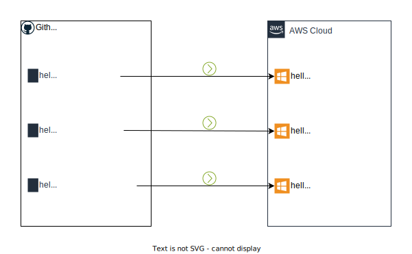

# Hello World Core

The purpose of this project it to lay a foundation for FCC Hello World, a
prototype of a walking skeleton for Windows. It is intended for developers to
get a feel for .NET products using github actions and AWS. It is a terraform
project and github actions to build a VPC and subnet that the infra-factory can
use to add ec2 virtual machines where developers' C# hello world .NET apps can
be deployed.

This is part of [a suite of
repositories](https://github.com/jimweller?tab=repositories&q=hello-world&type=&language=&sort=)
that work together to help new developers get up to speed quickly with a .NET
`Hello World` console app running on a Windows EC2 in AWS.

The overall pattern for this demo suite looks like the below
[diagram](diagrams/overview.drawio.svg). Each person forks the product
repository. The product repository has the functionality to create .NET builds
and AWS EC2 virtual machines.

The intended git flow would look like the below
[diagram](diagrams/git-flow-diagram.drawio.svg). A developer makes a branch and
makes changes to code (changing "Hello World" to "Hello \<NAME>" in this case).
When the developer creates a pull request, the updated code is compiled and
deployed to a new windows virtual machine. The virtual machines are immutable and ephemeral. Once the PR is merged the virtual machine is destroyed.

The IaC (OpenTofu) architecture is shown in the below
[diagram](diagrams/iac-arch.drawio.svg). The `foundation` github repository lays
basic network and IAM infrastructure to deploy and host Windows VMs. It also has
the github composite actions that are re-used by the `product` repositories. So,
when a developer creates a PR for `product`, the `product` github action uses
the `foundation` composite action to stamp out a ec2 windows vm based on the
definition in the `factory` repository.

